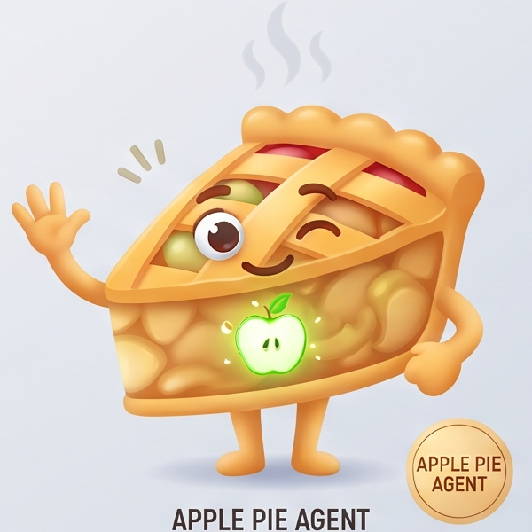
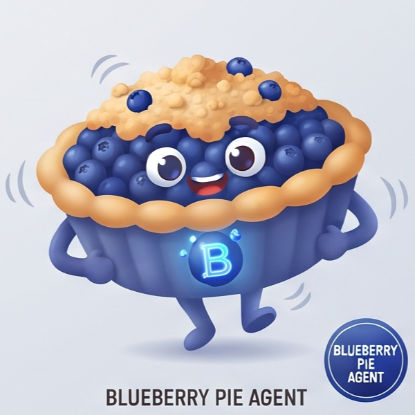
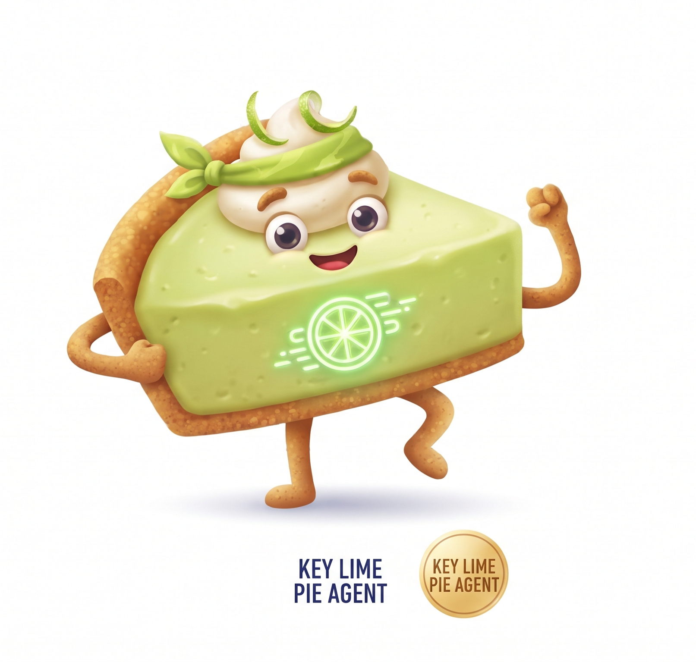

# P.I.E. — Process Intelligence Ecosystem

> **Turn plain business language and enterprise documents into validated, editable BPMN 2.0 diagrams, plain-language summaries, and discrete-event process simulations — powered by a multi-agent AI pipeline.**

Team **Prompt Cartel** · VWGDS India · Engineering [R&D] (I-DK-R)

---

## Table of Contents
- [Executive Overview](#executive-overview)
- [The Five-Agent AI Ecosystem](#the-five-agent-ai-ecosystem)
- [System Architecture](#system-architecture)
- [Repository & File Structure](#repository--file-structure)
- [Quick Start](#quick-start)
- [Runtime Profiles & Configuration](#runtime-profiles--configuration)
- [Showcase & Demonstration Test Cases](#showcase--demonstration-test-cases)
- [Core Engineering Highlights](#core-engineering-highlights)
- [Testing & Quality Assurance](#testing--quality-assurance)
- [Packaging for Submission](#packaging-for-submission)
- [Team](#team)

---

## Executive Overview

Paste a business narrative (or upload policies, SOPs, and transcripts) such as:
> *"An employee submits a leave request. The manager reviews the request within 3 days. If approved, HR updates the payroll system. Otherwise, the employee is notified with rejection reasons..."*

**P.I.E.** autonomously performs:
1. **Document & Entity Parsing**: Classifies document types and extracts structured activities, actors, systems, gateways, and business rules.
2. **Topology & Semantic Validation**: Constructs a directed process graph, checks boundary rules, detects dead-ends/unreachable states, and calculates a model quality score.
3. **BPMN 2.0 Generation & Layout**: Emits standards-compliant BPMN 2.0 XML with automated lane assignments and orthogonal Diagram Interchange (DI) edge routing.
4. **Executive Review & Conversational Refinement**: Generates plain-language walkthroughs, audits quality gaps, and supports real-time prompt-driven diagram edits via `ChatDock`.
5. **Discrete-Event Simulation & Process Mining**: Runs token-based stochastic simulations, pinpoints bottlenecks, measures SLA adherence, and exports synthetic event logs (CSV/XES) for tools like Celonis and Disco.

---

## The Five-Agent AI Ecosystem

| Mascot | Agent Stage | Nickname | Core Responsibility | Key Technologies & Output |
|:---:|---|---|---|---|
|  | **Agent 01: Extraction** | **Apple Pie** | Document stream ingestion, classification, actor/task/rule extraction, conflict resolution. | `KnowledgeExtractionService`, `document-classification-prompt.txt`, `ProcessKnowledgeDTO` |
|  | **Agent 02: Intelligence** | **Blueberry Pie** | Canonical graph construction, topology verification, semantic rule matching, and quality scoring. | `ProcessGraphBuilder`, `ProcessGraphValidator`, `ProcessQualityValidator`, `ProcessGraphDTO` |
|  | **Agent 03: Modelling** | **Cherry Pie** | BPMN 2.0 model generation, lane/pool structuring, visual DI coordinate calculation, and canvas rendering. | `BpmnDomainModelMapper`, `BpmnXmlGenerationService`, `bpmn-js`, BPMN 2.0 XML |
|  | **Agent 04: Review** | **Pecan Pie** | Business-language executive summaries, gap auditing, rule enforcement, and in-place chat refinement. | `AiProcessReviewService`, `AiBpmnRefinementService`, `ChatDock`, `ReviewReportDTO` |
|  | **Agent 05: Simulation** | **Key Lime Pie** | Discrete-event simulation, stochastic token animation, cycle-time & queue analytics, Celonis/Disco export. | `simulationEngine.ts`, `bpmnParser.ts`, `integrationBridge.ts`, `Recharts`, Event Logs |

---

## System Architecture

```
                                  BUSINESS USER / ENTERPRISE SYSTEM
                                                 │
                                                 ▼
                          ┌──────────────────────────────────────────────┐
                          │   Frontend UI (React 19 + TypeScript + Vite) │
                          │   • 3D Three.js Splash & Agent Dashboard     │
                          │   • Interactive BPMN Canvas (bpmn-js)        │
                          │   • Discrete-Event Simulation & Analytics    │
                          │   • Real-Time Copilot Dock (ChatDock)        │
                          └──────────────────────┬───────────────────────┘
                                                 │ REST / WebSocket
                                                 ▼
                          ┌──────────────────────────────────────────────┐
                          │     Spring Boot 3.3.0 Application Core       │
                          │     (Java 17, Maven, H2 / PostgreSQL)        │
                          └──────────────────────┬───────────────────────┘
                                                 │
                   ┌─────────────────────────────┼─────────────────────────────┐
                   ▼                             ▼                             ▼
       ┌───────────────────────┐   ┌───────────────────────┐   ┌───────────────────────┐
       │   Agent 01: Apple Pie │   │ Agent 02: Blueberry   │   │   Agent 03: Cherry    │
       │  Knowledge Extraction │   │ Process Intelligence  │   │     BPMN 2.0 Engine   │
       │  • OCR / Doc Parser   │   │  • Canonical Graph    │   │  • XML Generator      │
       │  • Entity Extraction  │   │  • Semantic Validator │   │  • DI Layout Engine   │
       │  • Conflict Audit     │   │  • Quality Scorer     │   │  • Orthogonal Routing │
       └───────────┬───────────┘   └───────────┬───────────┘   └───────────┬───────────┘
                   │                           │                           │
                   └───────────────────────────┼───────────────────────────┘
                                               │
                   ┌───────────────────────────┴───────────────────────────┐
                   ▼                                                       ▼
       ┌───────────────────────┐                               ┌───────────────────────┐
       │   Agent 04: Pecan Pie │                               │ Agent 05: Key Lime    │
       │     Process Review    │                               │ Simulation & Mining   │
       │  • Executive Summary  │                               │  • Discrete Events    │
       │  • Compliance Checks  │                               │  • SLA / Bottlenecks  │
       │  • Conversational Fix │                               │  • Celonis/Disco Logs │
       └───────────────────────┘                               └───────────────────────┘
```

---

## Repository & File Structure

```
Process-Intelligence-Ecosystem/
├── README.md                           # Master ecosystem documentation & architectural guide
├── PROFILES.md                         # Detailed environment profiles & LLM credential guide
├── RUN_INSTRUCTIONS.txt                # Self-contained submission setup and verification manual
├── pie.sh                              # Unified cross-platform CLI management script
├── docker-compose.yml                  # Container definition for PostgreSQL staging / prod
├── render.yaml                         # Cloud deployment blueprint specification
│
├── backend/                            # Spring Boot Java Application Backend
│   ├── pom.xml                         # Maven dependencies & build configuration
│   └── src/
│       ├── main/
│       │   ├── java/com/pie/
│       │   │   ├── backend/
│       │   │   │   ├── Application.java               # Spring Boot entry point
│       │   │   │   ├── config/
│       │   │   │   │   ├── AppConfig.java             # CORS, RestTemplate & bean definitions
│       │   │   │   │   ├── AsyncConfig.java           # Thread pool configuration for agents
│       │   │   │   │   └── SecurityConfig.java        # Security, CSP, and endpoint filters
│       │   │   │   ├── controller/
│       │   │   │   │   ├── AgentSessionController.java # Multi-agent orchestration endpoints
│       │   │   │   │   ├── ChatController.java        # Interactive BPMN refinement chat API
│       │   │   │   │   ├── DocumentAdminController.java# Uploaded file management & parsing
│       │   │   │   │   ├── H2ConsoleController.java   # Local database administration tooling
│       │   │   │   │   ├── HealthController.java      # Liveness, readiness, and profile status
│       │   │   │   │   ├── KnowledgeAdminController.java # Global entity ontology access
│       │   │   │   │   ├── LlmController.java         # LLM proxy & gateway routing
│       │   │   │   │   ├── ProcessController.java     # Primary process discovery pipeline API
│       │   │   │   │   └── RootController.java        # Default landing and redirect routes
│       │   │   │   ├── exception/
│       │   │   │   │   ├── GlobalExceptionHandler.java# Centralized REST error handling
│       │   │   │   │   └── LlmExceptionHandler.java   # LLM timeout and fallback handling
│       │   │   │   ├── model/
│       │   │   │   │   ├── DocumentEntity.java        # JPA entity for uploaded documents
│       │   │   │   │   ├── DocumentRecord.java        # Internal immutable document record
│       │   │   │   │   └── ProcessKnowledgeEntity.java# Persisted process blueprints
│       │   │   │   ├── repository/
│       │   │   │   │   ├── DocumentRepository.java    # Spring Data repository for files
│       │   │   │   │   └── ProcessKnowledgeRepository.java # Repository for process DTOs
│       │   │   │   ├── service/
│       │   │   │   │   ├── AgentLogger.java           # Structured logging & audit trail
│       │   │   │   │   ├── AiBpmnRefinementService.java # Natural-language diagram modifier
│       │   │   │   │   ├── AiClassificationService.java # NLP document classifier
│       │   │   │   │   ├── AiProcessQualityService.java # Quality heuristics & gap auditor
│       │   │   │   │   ├── AiProcessReviewService.java  # Executive business summary generator
│       │   │   │   │   ├── BpmnDomainModelMapper.java # GraphDTO to BPMN semantic mapper
│       │   │   │   │   ├── BpmnEditService.java       # Direct XML mutation operations
│       │   │   │   │   ├── BpmnVersionService.java    # Diagram revisioning and rollback
│       │   │   │   │   ├── BpmnXmlGenerationService.java # BPMN 2.0 XML + DI layout builder
│       │   │   │   │   ├── BpmnXmlParser.java         # XML deserializer and validator
│       │   │   │   │   ├── ClassificationService.java # Rule-based document classifier
│       │   │   │   │   ├── DocumentIngestionService.java # Multi-part file reader & sanitizer
│       │   │   │   │   ├── DocumentParsingService.java # Text extraction & OCR normalization
│       │   │   │   │   ├── DocumentStorageService.java # Local/cloud file persistence
│       │   │   │   │   ├── FallbackMockPipeline.java  # Deterministic offline mock fallbacks
│       │   │   │   │   ├── KnowledgeExtractionService.java # Agent 01 LLM entity extractor
│       │   │   │   │   ├── ProcessGraphBuilder.java   # Agent 02 canonical graph constructor
│       │   │   │   │   ├── ProcessGraphValidator.java # Graph completeness & dead-end checker
│       │   │   │   │   ├── ProcessKnowledgeNormalizer.java # Duplicate & alias resolver
│       │   │   │   │   ├── ProcessQualityValidator.java # Enterprise quality rule engine
│       │   │   │   │   ├── VwCloudIdpTokenService.java # OAuth2 token manager for VW LLMaaS
│       │   │   │   │   └── VwLlmaasService.java       # Gateway client for enterprise LLMs
│       │   │   │   └── util/
│       │   │   │       └── BpmnParser.java            # Helper utilities for XML structures
│       │   │   └── shared/
│       │   │       ├── bpmn/
│       │   │       │   └── BpmnProcessModel.java      # In-memory BPMN model structure
│       │   │       ├── dto/                           # Wire contracts & transfer objects
│       │   │       │   ├── BpmnGenerateRequestPayload.java
│       │   │       │   ├── ClassificationResultDTO.java
│       │   │       │   ├── EdgeType.java              # SEQUENCE, CONDITIONAL, DEFAULT, MESSAGE
│       │   │       │   ├── EventType.java             # START, END, TIMER, MESSAGE, ERROR
│       │   │       │   ├── GatewayType.java           # EXCLUSIVE, PARALLEL, INCLUSIVE
│       │   │       │   ├── GraphEdge.java             # Edge definition with source/target
│       │   │       │   ├── GraphNode.java             # Node definition with task type/lane
│       │   │       │   ├── NodeMetadata.java          # Coordinates, lane, documentation
│       │   │       │   ├── NodeType.java              # TASK, GATEWAY, EVENT, SUBPROCESS
│       │   │       │   ├── ProcessDocumentDTO.java
│       │   │       │   ├── ProcessGraphDTO.java       # Complete node/edge graph contract
│       │   │       │   ├── ProcessKnowledgeDTO.java   # Raw extracted knowledge blueprint
│       │   │       │   ├── ProcessQualityReportDTO.java # Gap analysis and score breakdown
│       │   │       │   ├── ReviewReportDTO.java       # Plain language summary & recommendations
│       │   │       │   ├── ValidationIssueDTO.java    # Individual quality rule violation
│       │   │       │   ├── ValidationResultDTO.java
│       │   │       │   └── llmaas/                    # VW LLMaaS / OpenAI API DTOs
│       │   │       └── types/
│       │   │           └── dto.ts                     # Cross-compiled TypeScript definitions
│       │   └── resources/
│       │       ├── application.yml                    # Base Spring Boot configuration
│       │       ├── application-local.yml              # Local profile: H2 in-memory + Ollama
│       │       ├── application-staging.yml            # Staging profile: PostgreSQL + VW LLMaaS
│       │       ├── application-prod.yml               # Production profile: Cloud DB + Gemini
│       │       ├── application-prod-h2.yml            # Production file-backed H2 configuration
│       │       └── prompts/                           # Grounded, anti-hallucination agent prompts
│       │           ├── bpmn-refinement-prompt.txt     # In-place chat diagram editing prompt
│       │           ├── chat-edit-prompt.txt           # Natural language XML operation prompt
│       │           ├── chat-prompt.txt                # Copilot conversational prompt
│       │           ├── document-classification-prompt.txt # Document taxonomy prompt
│       │           ├── knowledge-extraction-prompt.txt# Structured entity extraction prompt
│       │           ├── process-quality-review-prompt.txt # Heuristic validation prompt
│       │           └── process-review-summary-prompt.txt # Executive summary prompt
│       └── test/java/com/pie/backend/
│           ├── CanonicalProcessGraphBuilderTest.java  # Graph topology & gateway unit tests
│           ├── BpmnXmlGenerationServiceTest.java      # BPMN XML validity & DI layout tests
│           └── ProcessPipelineIntegrationTest.java    # Full end-to-end multi-agent tests
│
├── frontend/                           # React 19 + TypeScript Single Page Application
│   ├── package.json                    # Node dependencies, scripts & Vite config
│   ├── vite.config.ts                  # Vite build options, plugins & port config
│   ├── index.html                      # HTML root template with fonts and meta
│   ├── public/
│   │   ├── mascots/                    # Official high-resolution agent mascots
│   │   │   ├── ApplePie.png            # Agent 01: Extraction Mascot
│   │   │   ├── BlueBerryPie.png        # Agent 02: Intelligence Mascot
│   │   │   ├── CherryPie.png           # Agent 03: Modelling Mascot
│   │   │   ├── PecanPie.png            # Agent 04: Review Mascot
│   │   │   ├── KeyLimePie.png          # Agent 05: Simulation Mascot
│   │   │   └── Pie.png                 # Master P.I.E. Ecosystem Brand Logo
│   │   └── assets/
│   │       └── vwgds-logo.png          # VWGDS India corporate emblem
│   └── src/
│       ├── main.tsx                    # React application bootstrap entry
│       ├── App.tsx                     # Main workspace orchestrator & navigation
│       ├── App.css                     # Global P.I.E. luxury glassmorphism design system
│       ├── index.css                   # Root styling, background matrix & typography
│       ├── animation/
│       │   └── waapiLoop.ts            # Web Animations API continuous loop helper
│       ├── assets/                     # Static UI vector & raster graphics
│       ├── components/                 # UI components and agent workspaces
│       │   ├── SplashScreen.tsx        # 3D Three.js floating pie & particle splash
│       │   ├── SplashScreen.css        # Three.js canvas & progress bar styling
│       │   ├── AgentLoadingScreen.tsx  # Dynamic multi-step agent execution loader
│       │   ├── AgentLoadingScreen.css  # Orbit animation and mascot avatar styles
│       │   ├── AgentExecutionTracker.tsx # Real-time multi-stage pipeline status tracker
│       │   ├── AgentExecutionTracker.css # Glassmorphism tracker bar styling
│       │   ├── AppLayout.tsx           # Global shell layout wrapper
│       │   ├── BpmnIoCanvas.tsx        # Interactive BPMN 2.0 visual canvas (bpmn-js)
│       │   ├── BpmnIoCanvas.css        # Canvas controls, palette, and SVG theming
│       │   ├── BpmnImageViewer.tsx     # Lightweight read-only SVG diagram viewer
│       │   ├── ChatDock.tsx            # Floating AI Copilot dock for diagram edits
│       │   ├── ChatDock.css            # Copilot panel, message bubble, and FAB styles
│       │   ├── DashboardPage.tsx       # Enterprise workspace metrics & process catalog
│       │   ├── DocumentsPage.tsx       # Document management & classification table
│       │   ├── KnowledgeBasePage.tsx   # Global cross-process entity ontology viewer
│       │   ├── LandingPage.tsx         # Initial intake & dual-mode ingestion page
│       │   ├── LoginPage.tsx           # Authentication & role selector view
│       │   ├── ProcessEntry.tsx        # Drag-and-drop ingestion & sample narrative picker
│       │   ├── ProcessGraphViewer.tsx  # Interactive node inspector & graph explorer
│       │   ├── ProcessIntelligenceAgent.tsx # Agent 02 quality score & gap cards
│       │   ├── ProcessKnowledgeReview.tsx # Agent 01 normalized entity table & editor
│       │   ├── ProcessReviewAgent.tsx  # Agent 04 executive summary & issue auditor
│       │   ├── ProcessWorkspace.tsx    # Integrated multi-tab agent workspace
│       │   ├── SettingsPage.tsx        # System profile, endpoint & demo reset controls
│       │   ├── EditDrawer.tsx          # Slide-out source text editor & regenerator
│       │   ├── HistoryPanel.tsx        # Session history drawer with instant restore
│       │   ├── UploadModal.tsx         # Multi-document upload modal dialog
│       │   ├── WhatIsBpmn.tsx          # Educational guide on BPMN symbols & semantics
│       │   ├── TextToDiagramGenAnim.tsx # Scanning laser text-to-diagram SVG animation
│       │   ├── DiagramToSummaryGenAnim.tsx # Reverse summary translation SVG animation
│       │   ├── TypingMarkdown.tsx      # Smooth typewriter effect for AI explanations
│       │   └── simulation/             # Agent 05: Simulation & Process Mining Module
│       │       ├── ProcessMiningTab.tsx# Main simulation workspace & model selector
│       │       ├── AnalyticsDashboard.tsx # SLA, throughput & resource utilization charts
│       │       ├── BpmnViewer.tsx      # SVG viewer with active animated token flows
│       │       ├── ParameterPanel.tsx  # Case volume, arrival rate & cost config panel
│       │       ├── DynamicContextualChart.tsx # Dynamic Recharts contextual visualizer
│       │       └── simulation.css      # Scoped simulation luxury glassmorphism styles
│       ├── data/
│       │   └── corpusData.ts           # Pre-loaded benchmark process corpus
│       ├── services/                   # Business logic, state stores & API clients
│       │   ├── aiReviewService.ts      # Client for review and summary endpoints
│       │   ├── authService.ts          # Mock/session authentication manager
│       │   ├── bpmnLayout.ts           # Canvas layout and coordinate calculations
│       │   ├── bpmnParser.ts           # Client-side BPMN XML topology analyzer
│       │   ├── chatService.ts          # Streaming/REST client for ChatDock copilot
│       │   ├── documentService.ts      # Document upload and classification service
│       │   ├── historyStore.ts         # LocalStorage backed session history store
│       │   ├── icons.tsx               # Scalable vector iconography library
│       │   ├── integrationBridge.ts    # Celonis / Disco CSV & XES log export builder
│       │   ├── knowledgeService.ts     # Global entity repository client
│       │   ├── llmService.ts           # Direct client-side LLM inference hooks
│       │   ├── mockData.ts             # Deterministic demo fallback datasets
│       │   ├── processService.ts       # Core API client for backend discovery pipeline
│       │   ├── simulationEngine.ts     # Discrete-event simulation algorithm engine
│       │   ├── simulationTypes.ts      # TypeScript interfaces for simulation & logs
│       │   ├── trackerStore.ts         # Reactive state store for pipeline progress
│       │   └── types.ts                # Domain entity and view model definitions
│
├── samples/                            # Reference input narratives & documentation
├── showcase/                           # Curated competition benchmark cases
│   ├── cases/                          # Individual narrative text scenarios
│   └── expected_outputs.txt            # Acceptance criteria & regression test matrix
└── docs/                               # Architectural whitepapers & specification notes
```

---

## Quick Start

### 1. Automated Bootstrapping with `pie.sh`

```bash
# Clone the repository
git clone https://github.com/Hrutu34/Process-Intelligence-Ecosystem.git pie
cd pie

# Configure environment credentials (if using cloud/enterprise LLMs)
cp .env.example .env

# Make CLI executable
chmod +x pie.sh

# Verify system toolchain (Java 17, Maven, Node.js)
./pie.sh verify

# Build backend and frontend
./pie.sh build

# Launch both services with local profile (H2 in-memory)
./pie.sh start
```

### 2. Service Access Points

| Service Component | Port / Route | Description |
|---|---|---|
| **Frontend UI** | `http://localhost:5173` | React 19 single page workspace with dark/light mode |
| **Backend REST API** | `http://localhost:8080` | Spring Boot 3.3.0 orchestration services |
| **H2 Database Console** | `http://localhost:8080/h2-console` | In-memory database inspection (`jdbc:h2:mem:pie_db`) |
| **Health Endpoint** | `http://localhost:8080/api/health` | Active profile and service liveness check |

### 3. CLI Management Commands

```bash
./pie.sh start [profile]    # Start services (local, staging, prod, prod-h2)
./pie.sh stop [all|b|f]     # Gracefully terminate background services
./pie.sh status             # Inspect service health, PIDs, and ports
./pie.sh logs [b|f]         # Stream live backend or frontend console logs
./pie.sh test [all|b|f]     # Execute automated test suites
./pie.sh zip [filename.zip] # Package clean source archive for submission
```

---

## Runtime Profiles & Configuration

P.I.E. supports flexible deployment profiles configured in `backend/src/main/resources/`:

| Profile | Target Database | LLM Provider | Required Configuration |
|---|---|---|---|
| **`local`** *(Default)* | H2 in-memory | Local Ollama / Mock fallback | None (zero-config, offline ready) |
| **`staging`** | PostgreSQL | VW LLMaaS Enterprise Gateway | `VW_LLM_CLIENT_ID`, `VW_LLM_CLIENT_SECRET`, `VW_LLM_API_KEY` |
| **`prod`** | Managed Cloud DB | Google Gemini 1.5 / 2.0 | `GEMINI_API_KEY` |
| **`prod-h2`** | File-backed H2 | VW LLMaaS / OpenAI GPT-4o | `VW_LLM_*` or `OPENAI_API_KEY` |

See [`PROFILES.md`](PROFILES.md) for full credential configuration and deployment instructions.

---

## Showcase & Demonstration Test Cases

Six curated enterprise process narratives are pre-configured in [`showcase/`](showcase/):

1. **Case 1: Leave Request Approval** — Dual exclusive gateways with manager/HR role delegation.
2. **Case 2: Payment Processing & Retry Loop** — Loop-back boundary error handling with escalation paths.
3. **Case 3: Expense Reimbursement with 7-Day SLA** — Intermediate timer event emitting ISO-8601 duration (`P7D`).
4. **Case 4: Employee Onboarding Pipeline** — Parallel fork/join synchronization across 3 swimlanes (IT, HR, Facilities).
5. **Case 5: Purchase Requisition with Threshold Rules** — Rework loops with tiered executive financial authorization.
6. **Case 6: Order Fulfillment & Delivery Logistics** — Multi-lane parallel fulfillment with customer notification triggers.

---

## Core Engineering Highlights

### 1. Robust Extraction with Anti-Hallucination Guardrails
- Entity extraction prompts enforce strict grounding, preventing the LLM from inventing unmentioned actors or systems.
- Normalization engine automatically resolves synonym variations (e.g., *"HR Team"*, *"Human Resources"*, *"HR Dept"*).

### 2. Graph Engine with Semantic Matching
- **Token Overlap Scoring**: Discards generic stopwords (e.g., *"request"*, *"process"*) to prevent false cross-gateway wiring.
- **Complementary Condition Pairing**: Automatically pairs contradictory branches (e.g., *"Approved"* vs *"Rejected"*).
- **Parallel Fork/Join Synthesis**: Detects concurrent task sequences and ensures all branches rejoin at matching join gateways.

### 3. Standards-Compliant BPMN 2.0 Generation
- Automatically applies correct BPMN element types (`userTask`, `serviceTask`, `sendTask`, `manualTask`, `exclusiveGateway`, `parallelGateway`, `intermediateCatchEvent`).
- Dynamic lane calculation with expanded vertical and horizontal layout gutters prevents overlapping sequence flows.

### 4. Interactive In-Place Refinement Loop
- Natural-language commands in `ChatDock` (e.g., *"Insert a security review before the payment step"*) are parsed into structured operations and applied directly to the XML model with version rollback support.

### 5. Discrete-Event Simulation & Process Mining Engine
- Simulates token queues and probabilistic branching to compute cycle times, bottlenecks, and resource utilization.
- Generates synthetic event logs in CSV and XES formats compatible with enterprise process mining tools.

---

## Testing & Quality Assurance

Run the automated test suites using the CLI:

```bash
# Execute full system tests
./pie.sh test

# Execute backend JUnit tests only
./pie.sh test b

# Run focused graph builder tests
cd backend && ./mvnw test -Dtest=CanonicalProcessGraphBuilderTest
```

---

## Packaging for Submission

Generate a clean, self-contained source distribution zip:

```bash
./pie.sh zip submission.zip
```
The packaging script excludes build artifacts (`target/`, `dist/`, `node_modules/`, `.git/`) and bundles `RUN_INSTRUCTIONS.txt` at the root.

---

## Team

**Prompt Cartel** — VWGDS India · Engineering [R&D] (I-DK-R)

| Team Member | Engineering Focus |
|---|---|
| **Gaidhani, Prajwal** | Java Backend, Agentic Orchestration & Python Systems |
| **Kamble, Jay** | Agentic AI, Prompt Engineering & LLM Gateway Integration |
| **Surve, Hrutu** | Java Full Stack, React UI/UX Architecture, Three.js & Discrete-Event Simulation |

---

## License

Created for the **Volkswagen Group I.MOBILOTHON 2026**. Internal Innovation Demo & Prototype.
